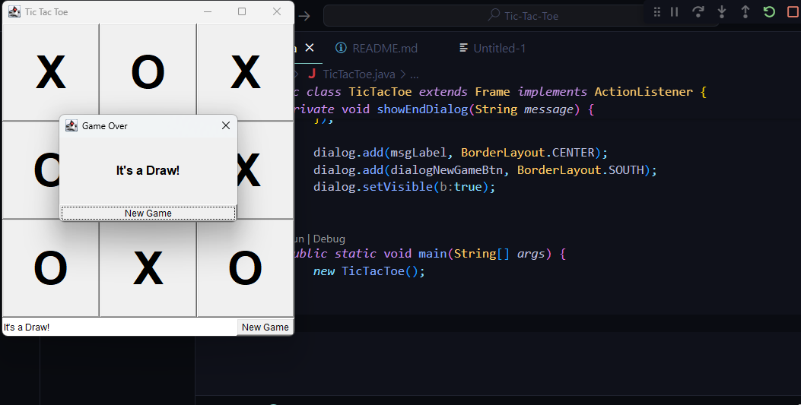
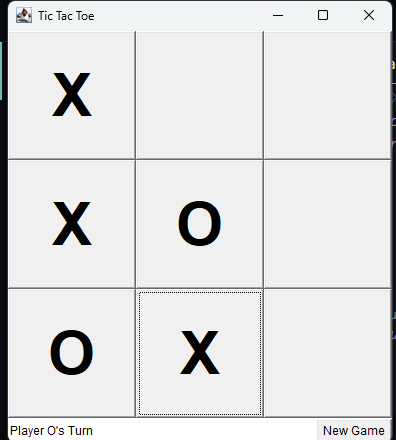
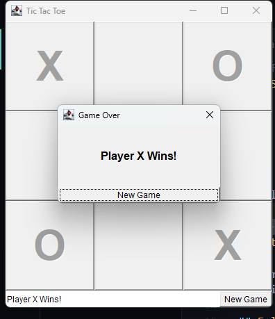
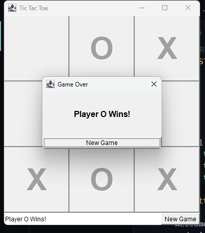

## Features of the Program
1. 3x3 Tic Tac Toe grid using Java AWT Buttons
2. Alternating turns between Player X and Player O
3. Automatic win and draw detection
4. Pop-up window displaying the winner or a draw
5. “New Game” button both on the main window and in the pop-up
6. GUI-based interaction with responsive layout

## INSTRUCTIONS FOR TIC-TAC-TOE

1. There are two (2) players for this game.
2. Each will take turns in placing their assigned symbols on each boxes in the grid. The symbols are X and O.
3. For a player to win, one must be able to place their three symbols in a row either diagonally, horizontally or vertically.
4. If no player wins the game, the game ends in a draw.
5. Players can start a new game after each round.

## Actual screenshots:

## Getting Started

Welcome to the VS Code Java world. Here is a guideline to help you get started to write Java code in Visual Studio Code.

## Folder Structure

The workspace contains two folders by default, where:

- `src`: the folder to maintain sources
- `lib`: the folder to maintain dependencies

Meanwhile, the compiled output files will be generated in the `bin` folder by default.

> If you want to customize the folder structure, open `.vscode/settings.json` and update the related settings there.

## Dependency Management

The `JAVA PROJECTS` view allows you to manage your dependencies. More details can be found [here](https://github.com/microsoft/vscode-java-dependency#manage-dependencies).
